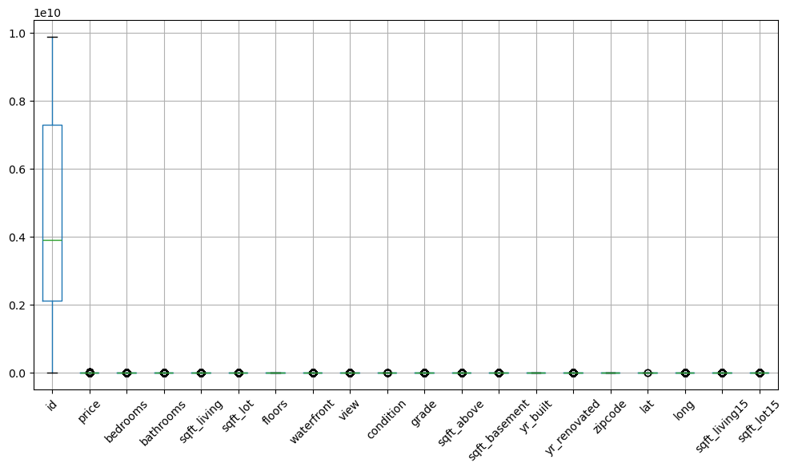
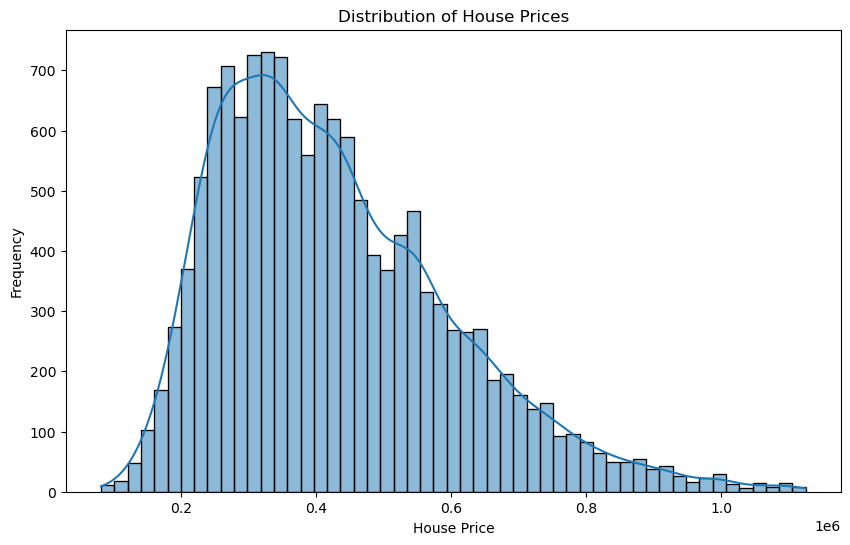
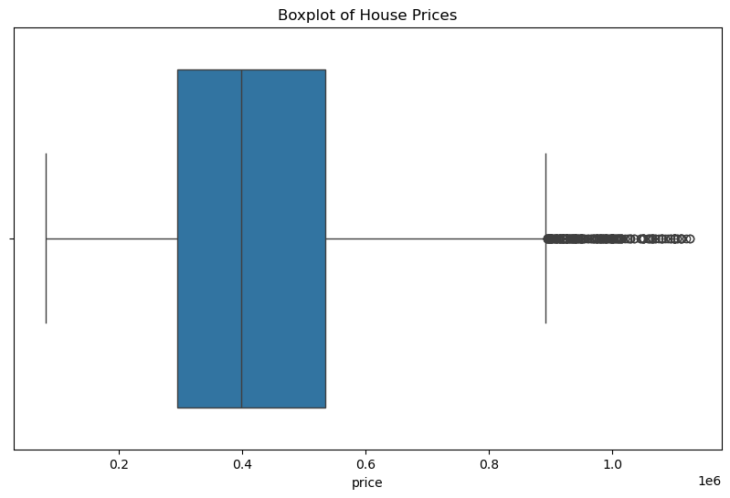
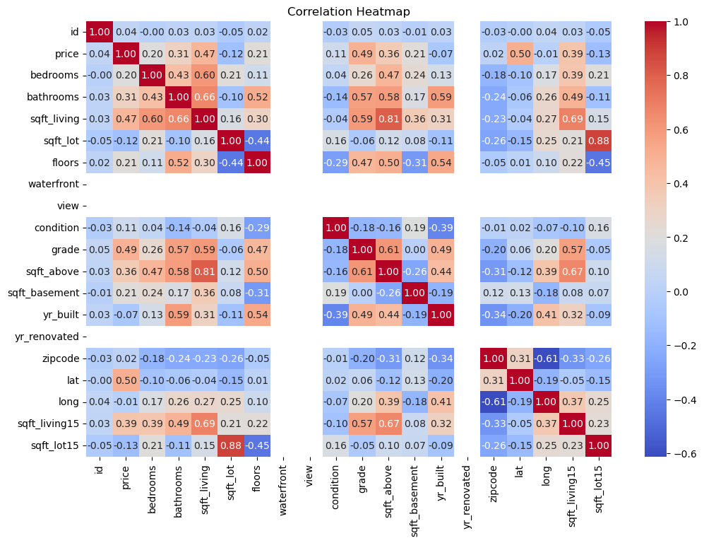
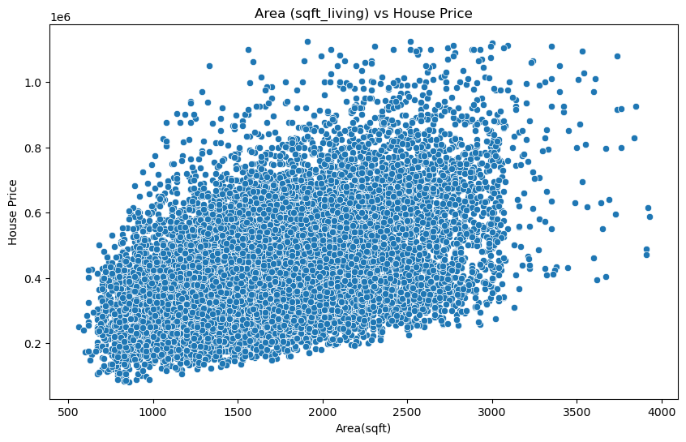
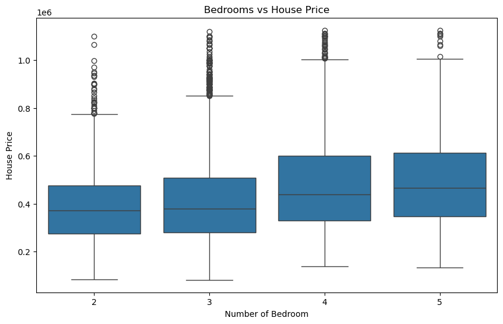
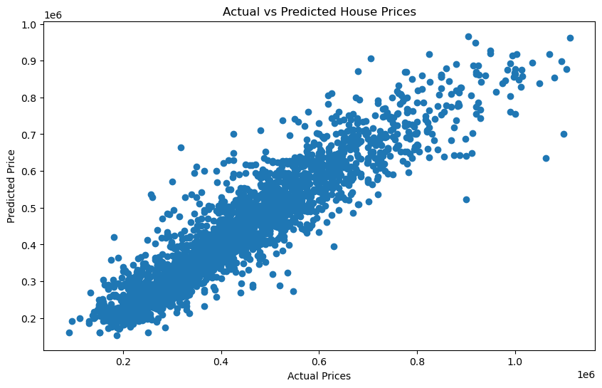
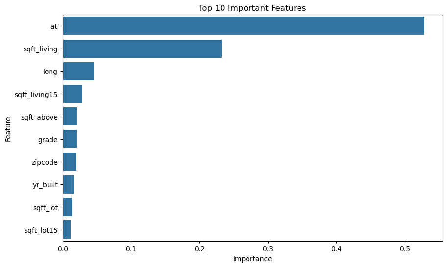

# 🏠 House Price Prediction

## 📌 Project Overview

This project focuses on predicting house prices using Machine Learning. The analysis includes data preprocessing, exploratory data analysis, feature engineering, model training, and evaluation.

## 🎯 Objectives

- Analyze the factors affecting house prices
- Perform data cleaning and preprocessing
- Explore relationships between features and house prices
- Build a machine learning regression model
- Evaluate model performance using regression metrics

## 🛠️ Technologies Used

- Python
- Pandas
- NumPy
- Matplotlib
- Seaborn
- Scikit-learn
- Jupyter Notebook

## 🔍 Project Workflow

1. Data Loading
2. Data Understanding
3. Data Cleaning
4. Exploratory Data Analysis
5. Feature Engineering
6. Train-Test Split
7. Model Building
8. Model Evaluation
9. Prediction Analysis

## 🤖 Machine Learning Model

The project uses a **Random Forest Regressor** to predict house prices.

Random Forest is an ensemble machine learning algorithm that combines multiple decision trees to produce a more reliable regression prediction.

## 📊 Model Performance

The Random Forest Regressor achieved an **R² score of approximately 0.87** on the evaluated dataset.

## 📈 Evaluation Metrics

The model is evaluated using regression metrics including:

- R² Score
- Mean Absolute Error (MAE)
- Mean Squared Error (MSE)
- Root Mean Squared Error (RMSE)

## 💡 Key Skills Demonstrated

- Data Cleaning
- Exploratory Data Analysis
- Feature Engineering
- Data Visualization
- Regression
- Random Forest
- Model Evaluation
- Python Programming
- Machine Learning

  ## 📊 Project Visualizations

### Price Distribution

### Feature Relationship Analysis

### Model Prediction Analysis

### Actual vs Predicted Prices

### Feature Importance

### Model Evaluation

### Residual Analysis

### Prediction Performance

👩‍💻 Author

Shabeena Bano

GitHub: https://github.com/shabeenabano

LinkedIn: https://www.linkedin.com/in/shabeena-bano-49861542b/
